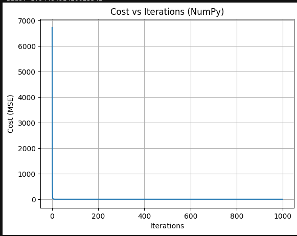
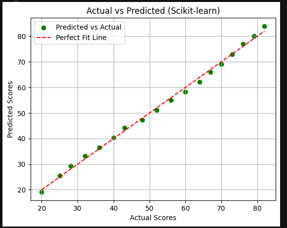

# CSOC 2025 – Week 0 Assignment (AI/ML Track)

### 👤 Name: Priyanshu Raj  
### 🏫 Roll Number: 24065087
### 🎓 College: IIT (BHU)

---

## 📌 Problem Statement

Implement **Multivariable Linear Regression** using 3 different methods:

- ✅ Pure Python (manual gradient descent)
- ✅ NumPy (vectorized gradient descent)
- ✅ Scikit-learn (LinearRegression)

Each model is evaluated using:
- MAE (Mean Absolute Error)
- RMSE (Root Mean Squared Error)
- R² Score
- Convergence plot (if applicable)

---

## 📊 Dataset

- 📈 Features: `Study Hours`, `Sleep Hours`
- 🎯 Target: `Score`

Total entries: 18  
Sample:

| Study Hours | Sleep Hours | Score |
|-------------|-------------|-------|
| 1.0         | 8.0         | 20    |
| 5.0         | 6.0         | 48    |
| 10.0        | 2.5         | 82    |

---

## 🚀 Final Evaluation (on full dataset)

| Method        | MAE    | RMSE   | R² Score |
|---------------|--------|--------|----------|
| Pure Python   | 1.0389 | 1.1861 | 0.9962   |
| NumPy         | 1.0389 | 1.1861 | 0.9962   |
| Scikit-learn  | 0.9803 | 1.1067 | 0.9967   |

---

## 📈 Plots

### 🔸 Cost Convergence – Pure Python

### 🔸 Cost Convergence – NumPy

### 🔸 Actual vs Predicted – Scikit-learn

---

## 📂 Files Included

- `pure_python.py` – Manual implementation
- `numpy_version.py` – Vectorized implementation
- `sklearn_version.py` – Using `LinearRegression`
- `Week_0_Report.pdf` – LaTeX compiled report
- PNG files – Cost/Prediction plots

---

## 💬 Conclusion

- Pure Python helped in understanding the math behind Linear Regression
- NumPy made training efficient via vectorized ops
- Scikit-learn was fastest and most accurate

> 🔥 A solid learning experience combining math, code & ML

---

